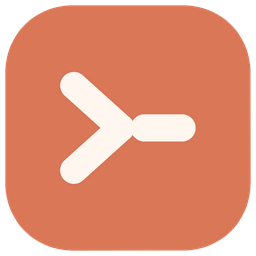
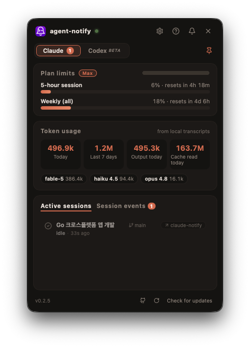

<div align="center">



<h1>agent-notify</h1>

<p><b>Never miss a finished coding-agent session — Claude Code, Codex, Antigravity, Gemini, opencode, Cursor.</b></p>

<p>
  <a href="https://github.com/CoderGangW/agent-notify/releases/latest"></a>
  
  
  <a href="LICENSE"></a>
</p>

<p>
  🇺🇸 <b>English</b>&nbsp;&nbsp;·&nbsp;&nbsp;🇰🇷 <a href="docs/README.ko.md">한국어</a>&nbsp;&nbsp;·&nbsp;&nbsp;🇨🇳 <a href="docs/README.zh-CN.md">简体中文</a>
</p>

<p>
  <a href="https://github.com/CoderGangW/agent-notify/releases/latest/download/agent-notify-macos-universal.app.zip"></a>
  <a href="https://github.com/CoderGangW/agent-notify/releases/latest/download/agent-notify-windows-amd64.exe"></a>
  <a href="https://github.com/CoderGangW/agent-notify/releases/latest/download/agent-notify-linux-amd64"></a>
</p>



</div>

A cross-platform (macOS / Windows / Linux) tray app that tells you **which coding-agent session just finished** when you're running several at once — Claude Code, Codex, Antigravity CLI, Gemini CLI, opencode, and Cursor CLI — with a dashboard for your sessions, token usage, and plan limits.

## Features

**Notifications**
- ✅ Native OS notification on task completion (Stop) / 🔔 when input is needed (Notification)
- Title = **session title** (including titles generated by the VSCode extension), body = **one-line AI summary** (`claude -p --model haiku`, your existing auth · falls back to an excerpt of the last reply)
- On macOS, notifications are posted natively by the app (its own icon, no dependencies) and a click **focuses the exact window the session ran in** — IDE (VSCode / Cursor / Windsurf), terminal tab, or multiplexer pane, auto-detected

**Dashboard window** — click the tray icon
- Recent session events: status, title, AI summary, one-click focus back to the session's IDE/terminal
- **Token usage** aggregated locally from `~/.claude/projects` transcripts (today / last 7 days / per model), deduped, animated odometer digits
- **Plan limit gauges** — the same 5-hour / weekly utilization the `/usage` command shows, with reset countdowns
- UI in English / 한국어 / 简体中文 (auto-detected, switchable in the window)

**Codex too**
- `agent-notify install-codex` wires the same notifications into the [Codex CLI](https://github.com/openai/codex) via its `notify` hook

## How it works

```
Claude Code ──(Stop / Notification hook)──▶ agent-notify hook ─┐
Codex CLI  ──(notify)──▶ agent-notify codex-hook ──────────────┤ POST localhost:49517
                                                                ▼
                                            tray daemon ──▶ OS notification
                                                 │
                                                 └──▶ dashboard window (sessions · usage · limits)
```

If the daemon isn't running, the hook falls back to sending the OS notification directly, so notifications keep working even with only the hook installed.

## Install

One line — downloads the binary, registers the Claude Code hooks, and sets up login autostart:

```sh
# macOS / Linux
curl -fsSL https://raw.githubusercontent.com/CoderGangW/agent-notify/main/install.sh | sh
```

```powershell
# Windows
irm https://raw.githubusercontent.com/CoderGangW/agent-notify/main/install.ps1 | iex
```

With Go installed:

```sh
go install github.com/CoderGangW/agent-notify@latest
agent-notify install   # register hooks + autostart + start the daemon
```

macOS users can also grab **agent-notify.app** (signed, universal) from the releases page — double-clicking it starts the daemon **and installs the hooks + login autostart on first run**, no terminal needed.

## Commands

| Command | Description |
|---|---|
| `agent-notify` | Run the tray daemon (default) |
| `agent-notify install` | Copy the binary to a stable path, register Stop/Notification hooks, login autostart, start the daemon |
| `agent-notify install-codex` | Register the Codex CLI `notify` hook in `~/.codex/config.toml` |
| `agent-notify uninstall` | Remove hooks and autostart |
| `agent-notify stats` | Debug: dump the usage + limits JSON the window shows |
| `agent-notify hook` / `codex-hook` | Hook endpoints called by Claude Code / Codex (never run manually) |
| `agent-notify peek <transcript.jsonl> [session-id]` | Debug: print the title/summary sources resolved for a session |

## Click-to-focus support

Clicking a notification, event, or active session jumps back to where it ran:

| Host | Precision | Notes |
|---|---|---|
| VSCode / Cursor / Windsurf | exact workspace window | |
| tmux | exact pane | window + pane + client switch |
| GNU screen | window | |
| WezTerm | exact pane | `wezterm cli` |
| kitty | window | needs `allow_remote_control` |
| iTerm2 | exact session | AppleScript |
| Zellij | pane (best effort) | needs a zellij with `focus-pane-with-id` |
| [cmux](https://cmux.com) | workspace + pane | set Settings → Automation → socket access to password/allowAll |
| any other terminal | app window | via its bundle id |

Multiplexer identities come from each tool's standard environment variables (`$TMUX_PANE`, `$CMUX_PANEL_ID`, `$WEZTERM_PANE`, …) captured by the hook — the same names on every machine.

## Platform notes

- **macOS**: notifications are native (UNUserNotificationCenter) — no extra tools needed. `terminal-notifier` is only used as a fallback when the daemon itself is down. The window UI is native (Wails v3 / WebKit). Local builds are packaged and signed with `build/release-macos.sh` (fixed bundle id `com.codergangw.claude-notify`).
- **Linux**: the window needs `libgtk-3` + `libwebkit2gtk-4.1` distro packages; tray needs `libayatana-appindicator`, notifications need `notify-send`. Hook-only notifications work without any of them. Install registers an app-menu launcher + icon.
- **Windows**: toast notifications, no extra dependencies. The exe has no console window.
- **AI summary**: used automatically when the `claude` CLI is on PATH. Disable with `CLAUDE_NOTIFY_NO_AI=1`.
- **Plan limits**: read from the same unofficial endpoint the `/usage` command uses, with your existing Claude Code auth (read-only; tokens are never refreshed or modified). If it breaks, the rest of the app is unaffected.

## Custom icon

Icons are generated from vector geometry by `tools/genicon` (PNG for trays, `.icns` for the macOS bundle, multi-size `.ico` for Windows) and embedded at build time:

```sh
go run ./tools/genicon assets && go build
```

## Roadmap

- [x] Click a notification / event to focus the session's IDE or terminal
- [x] Dashboard window: sessions, token usage, plan limits
- [x] Codex CLI support
- [ ] Focus the exact session panel inside the VSCode extension (blocked on a deep-link API from the extension)
- [ ] Webhooks (ntfy / Slack / Telegram / Discord) for away-from-keyboard alerts
- [ ] Live session status (PreToolUse/PostToolUse: running tool, elapsed time)
- [ ] Collect events from remote machines

## Release notes

Every release's changes live in [release_notes/](release_notes/) and on the [releases page](https://github.com/CoderGangW/agent-notify/releases).

## License

Source-available: you may use and redistribute unmodified copies freely (commercial use included), but creating or distributing modified versions requires written permission. See [LICENSE](LICENSE).
