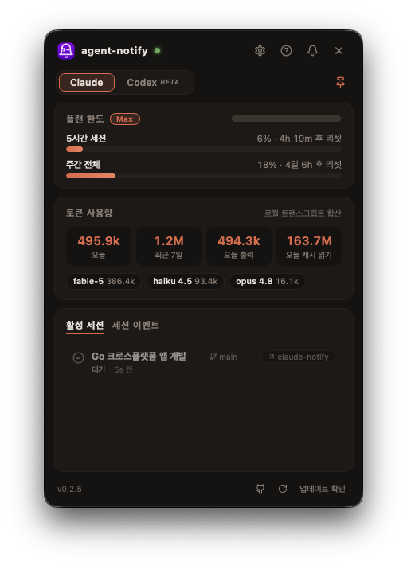

<div align="center">


<h1>agent-notify</h1>

<p><b>끝난 Claude Code 세션, 다시는 놓치지 마세요.</b></p>

<p>
  <a href="https://github.com/CoderGangW/agent-notify/releases/latest"></a>
  
  
  <a href="../LICENSE"></a>
</p>

<p>
  🇺🇸 <a href="../README.md">English</a>&nbsp;&nbsp;·&nbsp;&nbsp;🇰🇷 <b>한국어</b>&nbsp;&nbsp;·&nbsp;&nbsp;🇨🇳 <a href="README.zh-CN.md">简体中文</a>
</p>

<p>
  <a href="https://github.com/CoderGangW/agent-notify/releases/latest/download/agent-notify-macos-universal.app.zip"></a>
  <a href="https://github.com/CoderGangW/agent-notify/releases/latest/download/agent-notify-windows-amd64.exe"></a>
  <a href="https://github.com/CoderGangW/agent-notify/releases/latest/download/agent-notify-linux-amd64"></a>
</p>



</div>

여러 Claude Code 세션을 동시에 돌릴 때 **어느 세션이 방금 끝났는지** 알려주는 크로스플랫폼(macOS / Windows / Linux) 트레이 앱 — 세션·토큰 사용량·플랜 한도 대시보드 포함.

## 기능

**알림**
- ✅ 작업 완료(Stop) / 🔔 입력 필요(Notification) 시 네이티브 OS 알림
- 제목 = **세션 제목**(VSCode 익스텐션이 생성한 제목 포함), 본문 = **한 줄 AI 요약**(`claude -p --model haiku`, 기존 인증 사용 · 실패 시 마지막 응답 발췌)
- macOS 알림은 앱이 직접 발송(자체 아이콘, 의존성 없음), 클릭하면 **세션이 돌던 바로 그 창으로 포커스** — IDE(VSCode / Cursor / Windsurf), 터미널 탭, 멀티플렉서 팬 자동 감지

**대시보드 창** — 트레이 아이콘 클릭
- 최근 세션 이벤트: 상태, 제목, AI 요약, 클릭 한 번으로 해당 IDE/터미널 포커스
- **토큰 사용량** — `~/.claude/projects` 트랜스크립트 로컬 합산 (오늘 / 최근 7일 / 모델별), 중복 제거, 오도미터 숫자 애니메이션
- **플랜 한도 게이지** — `/usage` 명령이 보여주는 5시간/주간 사용률 + 리셋 카운트다운
- UI 언어: English / 한국어 / 简体中文 (자동 감지, 창에서 변경 가능)

**Codex도 지원**
- `agent-notify install-codex` 한 번이면 [Codex CLI](https://github.com/openai/codex)의 `notify` hook으로 같은 알림을 받음

## 동작 방식

```
Claude Code ──(Stop / Notification hook)──▶ agent-notify hook ─┐
Codex CLI  ──(notify)──▶ agent-notify codex-hook ──────────────┤ POST localhost:49517
                                                                ▼
                                            트레이 데몬 ──▶ OS 알림
                                                 │
                                                 └──▶ 대시보드 창 (세션 · 사용량 · 한도)
```

데몬이 꺼져 있으면 hook이 직접 OS 알림을 보내는 방식으로 폴백 — hook만 설치돼 있어도 알림은 계속 옵니다.

## 설치

한 줄 — 바이너리 다운로드, Claude Code hook 등록, 로그인 자동 시작까지:

```sh
# macOS / Linux
curl -fsSL https://raw.githubusercontent.com/CoderGangW/agent-notify/main/install.sh | sh
```

```powershell
# Windows
irm https://raw.githubusercontent.com/CoderGangW/agent-notify/main/install.ps1 | iex
```

Go가 설치돼 있다면:

```sh
go install github.com/CoderGangW/agent-notify@latest
agent-notify install   # hook 등록 + 자동 시작 + 데몬 시작
```

macOS는 릴리즈 페이지의 **agent-notify.app**(서명됨, 유니버설)을 받아 더블클릭만 하면 됩니다 — 첫 실행 시 데몬 시작과 함께 **hook·로그인 자동 시작까지 자동 설치**됩니다 (터미널 불필요).

## 명령어

| 명령 | 설명 |
|---|---|
| `agent-notify` | 트레이 데몬 실행 (기본) |
| `agent-notify install` | 바이너리를 고정 경로에 복사, Stop/Notification hook 등록, 자동 시작, 데몬 시작 |
| `agent-notify install-codex` | `~/.codex/config.toml`에 Codex CLI `notify` hook 등록 |
| `agent-notify uninstall` | hook과 자동 시작 제거 |
| `agent-notify stats` | 디버그: 창에 표시되는 사용량 + 한도 JSON 출력 |
| `agent-notify hook` / `codex-hook` | Claude Code / Codex가 호출하는 hook 엔드포인트 (직접 실행 X) |
| `agent-notify peek <transcript.jsonl> [session-id]` | 디버그: 세션의 제목/요약 소스 확인 |

## 클릭-포커스 지원 범위

알림·이벤트·활성 세션을 클릭하면 실행되던 곳으로 이동합니다:

| 호스트 | 정밀도 | 비고 |
|---|---|---|
| VSCode / Cursor / Windsurf | 정확한 워크스페이스 창 | |
| tmux | 정확한 페인 | 윈도우 + 페인 + 클라이언트 전환 |
| GNU screen | 윈도우 | |
| WezTerm | 정확한 페인 | `wezterm cli` |
| kitty | 윈도우 | `allow_remote_control` 필요 |
| iTerm2 | 정확한 세션 | AppleScript |
| Zellij | 페인 (베스트 에포트) | `focus-pane-with-id` 지원 버전 필요 |
| [cmux](https://cmux.com) | 워크스페이스 + 페인 | Settings → Automation → socket 접근을 password/allowAll로 |
| 그 외 터미널 | 앱 창 | 번들 ID 기반 |

멀티플렉서 식별은 각 도구의 표준 환경변수(`$TMUX_PANE`, `$CMUX_PANEL_ID`, `$WEZTERM_PANE` 등)를 hook이 캡처하는 방식 — 어느 머신에서나 같은 이름입니다.

## 플랫폼 참고

- **macOS**: 알림은 네이티브(UNUserNotificationCenter) — 별도 도구 불필요. `terminal-notifier`는 데몬이 죽어있을 때의 폴백으로만 사용. 창 UI는 네이티브(Wails v3 / WebKit). 로컬 빌드는 `build/release-macos.sh`로 패키징·서명 (번들 ID `com.codergangw.claude-notify` 고정).
- **Linux**: 창 UI는 `libgtk-3` + `libwebkit2gtk-4.1` 필요; 트레이는 `libayatana-appindicator`, 알림은 `notify-send`. 없어도 hook 단독 알림은 동작. 설치 시 앱 메뉴 런처 + 아이콘 등록.
- **Windows**: 토스트 알림, 추가 의존성 없음. exe 실행 시 콘솔창 안 뜸.
- **AI 요약**: PATH에 `claude` CLI가 있으면 자동 사용. `CLAUDE_NOTIFY_NO_AI=1`로 비활성화.
- **플랜 한도**: `/usage` 명령과 같은 비공식 엔드포인트를 기존 Claude Code 인증으로 읽기 전용 조회 (토큰 갱신/수정 안 함). 깨져도 앱 나머지는 정상 동작.

## 커스텀 아이콘

아이콘은 `tools/genicon`이 벡터 지오메트리에서 생성 (트레이용 PNG, macOS 번들용 `.icns`, Windows용 멀티사이즈 `.ico`) 후 빌드 타임에 임베드:

```sh
go run ./tools/genicon assets && go build
```

## 로드맵

- [x] 알림/이벤트 클릭으로 세션의 IDE 또는 터미널 포커스
- [x] 대시보드 창: 세션, 토큰 사용량, 플랜 한도
- [x] Codex CLI 지원
- [ ] VSCode 익스텐션의 특정 세션 패널까지 포커스 (익스텐션 딥링크 API 필요)
- [ ] Webhook (ntfy / Slack / Telegram / Discord) — 자리 비웠을 때 폰 알림
- [ ] 실시간 세션 상태 (PreToolUse/PostToolUse: 실행 중인 도구, 경과 시간)
- [ ] 원격 머신 이벤트 수집

## 릴리즈 노트

버전별 변경사항은 [release_notes/](../release_notes/)와 [릴리즈 페이지](https://github.com/CoderGangW/agent-notify/releases)에서 볼 수 있습니다.

## 라이선스

소스 공개형 라이선스: 무수정 사용·재배포는 자유(상업적 사용 포함)이나, 수정 및 수정본 배포는 서면 허가 필요. [LICENSE](../LICENSE) 참고.
