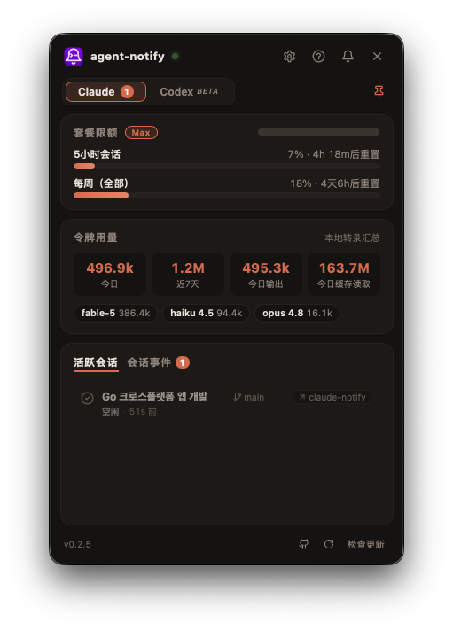

<div align="center">


<h1>agent-notify</h1>

<p><b>不再错过任何一个完成的编码代理会话 — Claude Code · Codex · Antigravity · Gemini · opencode · Cursor。</b></p>

<p>
  <a href="https://github.com/CoderGangW/agent-notify/releases/latest"></a>
  
  
  <a href="../LICENSE"></a>
</p>

<p>
  🇺🇸 <a href="../README.md">English</a>&nbsp;&nbsp;·&nbsp;&nbsp;🇰🇷 <a href="README.ko.md">한국어</a>&nbsp;&nbsp;·&nbsp;&nbsp;🇨🇳 <b>简体中文</b>
</p>

<p>
  <a href="https://github.com/CoderGangW/agent-notify/releases/latest/download/agent-notify-macos-universal.app.zip"></a>
  <a href="https://github.com/CoderGangW/agent-notify/releases/latest/download/agent-notify-windows-amd64.exe"></a>
  <a href="https://github.com/CoderGangW/agent-notify/releases/latest/download/agent-notify-linux-amd64"></a>
</p>



</div>

同时运行多个编码代理时，很容易搞不清哪个刚刚完成、哪个正在等你输入、套餐额度又用掉了多少。**agent-notify** 是一个适用于 macOS · Windows · Linux 的轻量托盘应用，一次解决这三个问题：会话完成或需要输入时立即通知你，一键跳回它运行所在的那个窗口，并把会话、token 用量和套餐额度汇总在一个仪表盘里。

## 你能得到什么

**第一时间知道会话完成了，还是卡住了**
- ✅ 任务完成时发送系统原生通知，🔔 代理等待你的输入或权限确认时也会通知
- 通知本身就告诉你是*哪个*会话：标题 = 会话自己的标题（包括 VSCode 扩展设置的标题），正文 = 一句话 AI 摘要说明它做了什么（失败时回退为最后一条回复的摘录）
- 四档通知模式 — **开启**、**仅提醒**、**安静**（只显示角标，不弹横幅）、**静音**

**直接跳回去**
- 点击通知、事件或活动会话，会话运行所在的那个窗口会被带到最前 — IDE 工作区（VSCode / Cursor / Windsurf）、终端标签页或多路复用器面板
- 多根 `.code-workspace` 和子文件夹中的会话会聚焦已经显示它们的窗口，而不是新开一个

**所有代理，一个仪表盘** — 点击托盘图标
- 你选择的每个代理各有一个标签页；每页都有设置清单（已安装 · 已登录 · 钩子已连接）和一键修复按钮
- **活动会话**及实时状态 — 工作中 · 等待输入 · 空闲
- **会话事件**流 — 未读角标、搜索、筛选
- **用量统计** — 按小时 / 天 / 月的 token 图表（滚轮缩放、拖拽平移），按模型区分
- **套餐额度仪表** — 与 `/usage` 显示一致的 5 小时和每周使用率，附重置倒计时
- English / 한국어 / 简体中文，浅色 / 深色 / 跟随系统主题，登录时自启动，新版本通知与一键安装

## 支持的代理

| 代理 | 任务完成 | 需要输入 | 实时会话状态 | 用量与额度 | 接入命令 |
|---|:-:|:-:|:-:|---|---|
| **Claude Code** | ✅ | ✅ | ✅ | token 用量 + 套餐额度 | `agent-notify install` |
| **Codex CLI** | ✅ | — | — | — | `agent-notify install-codex` |
| **Gemini CLI**（测试版） | ✅ | ✅ | ✅ | — | `agent-notify install-gemini` |
| **Antigravity CLI**（测试版） | ✅ | — | ✅ | 模型配额仪表 | `agent-notify install-antigravity` |
| **opencode**（测试版） | ✅ | ✅（权限请求） | ✅ | token 与费用用量 | `agent-notify install-opencode` |
| **Cursor CLI**（测试版） | ✅ | — | ✅ | — | `agent-notify install-cursor` |

接入命令只需运行一次：它会把 agent-notify 注册到该代理自己的钩子 / 插件配置中，可用 `agent-notify uninstall` 撤销。仪表盘的设置清单会替你执行这些命令，所以基本不需要打开终端。

## 点击聚焦支持范围

| 会话运行位置 | 聚焦目标 | 备注 |
|---|---|---|
| VSCode / Cursor / Windsurf | 精确的工作区窗口 | 支持多根工作区与子文件夹 |
| tmux | 精确的面板 | 切换窗口、面板和客户端 |
| WezTerm | 精确的面板 | |
| iTerm2 | 精确的会话 | |
| kitty | 窗口 | 需要 `allow_remote_control` |
| GNU screen | 窗口 | |
| Zellij | 面板（尽力而为） | 需要支持 `focus-pane-with-id` 的 zellij 版本 |
| [cmux](https://cmux.com) | 工作区 + 面板 | 将 Settings → Automation → socket 访问设为 password/allowAll |
| 其他终端 | 应用窗口 | |

各平台精度：**macOS** — 以上全部。**Windows** — 将会话所在窗口带到最前。**Linux** — 打开会话的项目文件夹。

## 安装

一行命令完成下载、接入 Claude Code 并设置登录自启动：

```sh
# macOS / Linux
curl -fsSL https://raw.githubusercontent.com/CoderGangW/agent-notify/main/install.sh | sh
```

```powershell
# Windows
irm https://raw.githubusercontent.com/CoderGangW/agent-notify/main/install.ps1 | iex
```

**macOS，无需终端：** 通过上方按钮下载 **agent-notify.app**（已签名、通用版）并打开 — 首次启动会自动接入 Claude Code 并注册登录自启动，然后请求所需的通知和文件夹访问权限。

已安装 Go：`go install github.com/CoderGangW/agent-notify@latest && agent-notify install`。

其他代理可在仪表盘的代理选择器中添加，或使用上表中的 `install-*` 命令接入。`agent-notify uninstall` 会移除所有钩子和自启动项。

## 平台说明

- **macOS** — 使用应用自有图标的原生通知，无需额外工具。首次启动会请求通知权限以及桌面 / 文稿 / 下载文件夹的访问权限（有了文件夹访问权限，点击才能聚焦到精确的 IDE 窗口）。
- **Windows** — Toast 通知，无额外依赖，不弹控制台窗口。
- **Linux** — 通知依赖 `notify-send`；仪表盘窗口需要 `libgtk-3` 和 `libwebkit2gtk-4.1`，托盘图标需要 `libayatana-appindicator`。即使没有这些，基于钩子的通知仍可工作。
- **AI 摘要**使用你已登录的 `claude` CLI（Haiku，每条通知消耗少量 token）。可在设置中关闭，或通过 `CLAUDE_NOTIFY_NO_AI=1` 禁用。

## 隐私

一切都留在你的电脑上。token 用量由本地转录文件计算；套餐额度使用 Claude Code 已保存的凭据只读查询 — 不会刷新、修改或上传。所有网络请求都是你看得见的：额度查询、可选的 AI 摘要，以及新版本检查。

## 路线图

- [x] 点击通知 / 事件聚焦会话所在的 IDE 或终端
- [x] 仪表盘：会话、token 用量、套餐额度
- [x] Codex · Gemini · Antigravity · opencode · Cursor
- [ ] 聚焦到 VSCode 扩展内的具体会话面板（等待扩展提供深链 API）
- [ ] Webhook（ntfy / Slack / Telegram / Discord）— 离开电脑时的手机提醒
- [ ] 收集远程机器的事件

## 发行说明

每个版本的变更记录见 [release_notes/](../release_notes/) 和 [发布页面](https://github.com/CoderGangW/agent-notify/releases)。

## 许可证

源码可见许可：可自由使用和再分发未修改的副本（包括商业用途），但创建或分发修改版本需获得书面许可。详见 [LICENSE](../LICENSE)。
